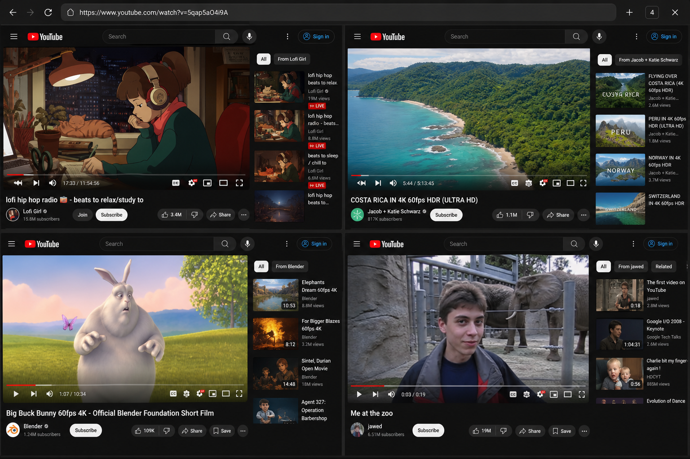
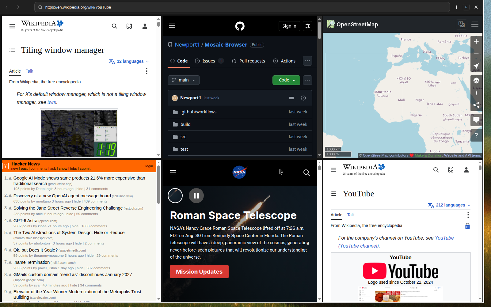
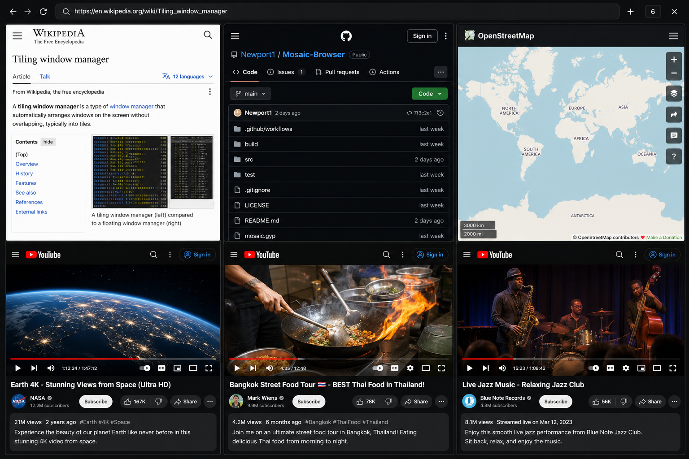

# Mosaic

Mosaic is a fullscreen tiled desktop browser. It has no tab strip and no artificial page limit: every new page becomes another live tile and the entire grid reflows to keep all pages visible.







*Screenshots by Cursor.*

## Download

Prebuilt macOS and Windows installers are attached to every successful [Build desktop installers](https://github.com/Newport1/Mosaic-Browser/actions/workflows/build-desktop.yml) run. GitHub requires you to be signed in to download Actions artifacts.

The latest installers from `main` are on this successful run:

**[Download Mosaic installers](https://github.com/Newport1/Mosaic-Browser/actions/runs/32814992206)**

| Platform | Artifact | Contents |
| --- | --- | --- |
| macOS (Apple Silicon) | [Mosaic-macOS-Apple-Silicon-DMG](https://github.com/Newport1/Mosaic-Browser/actions/runs/32814992206/artifacts/9551104021) | Disk image (`.dmg`) |
| macOS (Apple Silicon) | [Mosaic-macOS-Apple-Silicon-App](https://github.com/Newport1/Mosaic-Browser/actions/runs/32814992206/artifacts/9551105474) | Zipped `.app` |
| Windows | [Mosaic-Windows](https://github.com/Newport1/Mosaic-Browser/actions/runs/32814992206/artifacts/9551112986) | NSIS installer and portable `.exe` |

Artifacts expire after 14 days. To mint a fresh build, open **Actions → Build desktop installers → Run workflow**.

### Install on macOS

1. Download **Mosaic-macOS-Apple-Silicon-DMG** (or the App zip) and unzip the GitHub artifact.
2. Open `Mosaic-0.1.0-mac-arm64.dmg` and drag **Mosaic** into Applications, or unzip the `.app` archive and move it there.
3. CI builds are ad-hoc signed. On first launch, right-click the app and choose **Open**, or allow it under **System Settings → Privacy & Security**.

### Install on Windows

1. Download **Mosaic-Windows** and unzip the GitHub artifact.
2. Run the NSIS installer (`Mosaic-0.1.0-win-x64.exe`), or use the portable `.exe` without installing.
3. Windows SmartScreen may warn because the build is unsigned. Choose **More info → Run anyway** if you trust this repository's artifact.

## Interaction model

- Click a tile to expand it over the workspace.
- Use the grid control in the bottom-right corner, or press **Esc**, to return the page to its exact grid position.
- Use the toolbar **+** control or **Cmd/Ctrl+T** to add another page. Links that request a new window also become new tiles.
- Use **Cmd/Ctrl+W** to close the active page and **Cmd/Ctrl+L** to focus its address bar.
- Right-click the toolbar **×** and confirm to close Mosaic and every open tab.
- Use **F11** to toggle operating-system fullscreen.

The browser chrome follows the operating system light or dark appearance automatically.

## Run locally

```bash
npm install
npm start
```

The app starts in operating-system fullscreen. For development in a normal window:

```bash
npm run start:windowed
```

## Verify

```bash
npm test
npm run check
```

## Package

Run `npm run dist:mac` on macOS to create DMG and ZIP builds, or `npm run dist:win` on Windows to create installer and portable EXE builds. Cross-platform release builds are best produced on their target operating system.

Every push and pull request runs the tests and then builds both platforms in GitHub Actions. Prefer the [Download](#download) links above; from any other workflow run, open **Artifacts** and download `Mosaic-macOS-Apple-Silicon-DMG`, `Mosaic-macOS-Apple-Silicon-App`, or `Mosaic-Windows`.

### Linux development libraries

The packaged applications include their runtime requirements on macOS and Windows. To run Electron in an Ubuntu/Debian development container, install its graphical dependencies and a virtual display:

```bash
sudo apt-get update
sudo apt-get install -y xvfb libgtk-3-0 libnss3 libasound2 \
  libxss1 libgbm1 libatk-bridge2.0-0 libdrm2 libxkbcommon0
xvfb-run -a npm start
```

Ubuntu 24.04 minimal images may name the audio package `libasound2t64` instead of `libasound2`.

The UI uses plain HTML, CSS, and JavaScript. Each website runs in an isolated, sandboxed Electron `WebContentsView`; no framework or runtime service is required.

## License and project origin

Mosaic is licensed under the **GNU General Public License v3.0 only (GPL-3.0-only)**. You may use, modify, and redistribute Mosaic under those terms. A distributed work based on Mosaic must remain GPL-licensed and make its corresponding source available as required by the license.

Mosaic's defining interaction model is **tile-first browsing**: the live tiled grid is the primary browsing surface, while fullscreen is a temporary secondary view of a selected tile. This repository is the origin of this Mosaic implementation and its documented interaction model. When redistributing Mosaic or a derivative, preserve the project's copyright and license notices and credit `Newport1/Mosaic-Browser` as the source of the implementation.
